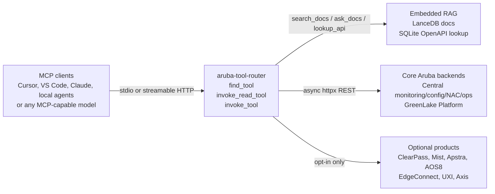

# centralmcp — HPE Networking MCP toolkit

[](LICENSE)
[](https://www.python.org/)
[](https://modelcontextprotocol.io/)
[](https://github.com/secure-ssid/centralmcp/actions/workflows/ci.yml)
[](https://secure-ssid.github.io/centralmcp/)
[](https://github.com/secure-ssid/centralmcp/releases)


**Low-token Model Context Protocol (MCP) server for HPE Networking automation: Aruba Central, HPE GreenLake Platform (GLP) automation, ClearPass, Juniper Mist, Apstra, ArubaOS 8 migration automation, EdgeConnect, HPE Aruba UXI, and Axis Atmos Cloud.**

centralmcp gives MCP-capable AI clients a low-token way to search Aruba/HPE docs, look up exact OpenAPI details, inspect Central health, run troubleshooting workflows, manage configuration, execute guarded ArubaOS 8 migrations, and use guarded GreenLake Platform operations.

It is built around direct REST calls with `httpx`.

## Version 0.6.0 highlights

The current 0.6 branch expands the executable backend catalog to 6,545 tools:
319 core tools / 2712 read-only optional starters / 5641 read-write optional starters.
It also adds fail-closed AAA server-group lifecycle tools and AOS8 adapter
wiring, corrects New Central config-assignment and device-auth profile request
shapes, and grows the RAG corpus to 51,737 prose chunks with official HPE Aruba
and Juniper security advisories plus HPE/Mist/Apstra lifecycle notices.

## Version 0.5.0 highlights

Version 0.5.0 is a verified ArubaOS 8 (AOS8) migration release: it does not
change tool counts, add new platforms, or claim exact secured-WLAN apply
parity between Classic Central and New Central. Investigation effort was
equal across both targets; the honest result is narrower than "parity."
The 0.5.0 catalog contained 291 core tools, 2,450 read-only optional starters,
and 5,258 read-write optional starters; enabling generated GLP expanded the
complete backend index to 6,162.

- **Hardened AOS8 source foundation:** normalized WLAN security intent,
  role-only AAA handling, type-aware auth-server dependencies, redaction
  fixes, additional source aliases, and fail-closed warnings for malformed or
  ambiguous export fields.
- **Bounded, honest Classic Central write lifecycle:** full `full_wlan`
  GET/POST/complete-PUT with a mandatory read-back; verified `exact` mappings
  for open and WPA3-Personal WLANs; conditional, dry-run-only WPA3 Enterprise
  gated on an explicit existing auth-server reference; precise
  manual/unsupported guidance for every object with no verified REST;
  dedicated Classic target resolution that is never inferred from a New
  Central scope; and no automatic AP-group equivalence.
- **Expanded, still fail-closed New Central mappings:** secured WLAN preview
  mappings for OPEN, WPA2_PERSONAL, WPA3_SAE, and ENHANCED_OPEN; pure SAE
  transition mode stays disabled; role assignment is verified independently
  of the role object; auth-server/server-group/AAA/dot1x/macauth object
  contracts remain blocked pending config-assignment profile-type
  confirmation; and routes, VRRP, AP-group mapping, and custom policy remain
  fail-closed.
- **Six-state verification taxonomy:** `aos8_verify_migration_run` reports
  `verified`, `partially_verified`, `failed`, `unverifiable`, `unsupported`,
  or `not_applied`, with bounded pagination, exact-path (generated-spec)
  precedence, Classic flat/nested schema awareness, and independent
  assignment verification.
- **Non-persistent operator context, wholesale secret redaction, no new
  rollback claim:** preview-only operator maps/external references are never
  persisted and are rejected outright by persistent runs; stale persisted
  state referencing removed context is sanitized; real secret values are
  wholesale-redacted everywhere; and no rollback workflow is added beyond the
  existing checkpoint-policy/export-before-apply guidance.
- **Read-only live/dry-run evaluation:** a GET-only New Central
  preflight/preview evaluation was completed live against a configured
  tenant; AOS8 source and Classic Central access were unavailable in that
  environment and were evaluated fixture-backed only. No writes were
  attempted anywhere. See
  [docs/aos8-live-dryrun-evaluation.md](docs/aos8-live-dryrun-evaluation.md)
  and the [AOS8 migration contract matrix](docs/aos8-migration-contract-matrix.md).
- **Verified at the release gate:** 1,534 unit tests passed (including 10
  MCP protocol end-to-end tests), a 20-sample RAG/API eval green, and the
  6,162-tool backend catalog and 5,703-operation generated manifest count
  both reconfirmed unchanged.

See the [complete 0.6.0 release notes](docs/release-notes-0.6.0.md). The
[0.5.0 release notes](docs/release-notes-0.5.0.md) and earlier notes remain
available for historical context.



## Search keywords

HPE Networking MCP server, HPE Aruba Networking MCP server, HPE Aruba Central
MCP server, HPE Aruba Networking Central MCP server, Aruba Central AI tools,
AI network automation, HPE GreenLake Platform MCP, GreenLake
Platform automation, GreenLake Platform MCP, GreenLake service catalog MCP,
GreenLake reporting status MCP, FastMCP network automation, Model Context
Protocol networking, network configuration MCP, Aruba API RAG, Aruba Central
OpenAPI lookup, ClearPass MCP, Juniper Mist MCP, Apstra MCP, ArubaOS 8 MCP,
ArubaOS 8 migration MCP, ArubaOS 8 migration automation, AOS8 automation,
Classic Central migration, New Central migration, guarded dry-run migration,
HPE Aruba EdgeConnect MCP,
EdgeConnect SD-WAN MCP, HPE Aruba UXI MCP, UXI sensor status MCP,
Axis Atmos Cloud MCP,
guarded read/write lab automation, EdgeConnect zones, EdgeConnect interface
labels, zone-based firewall MCP, Python `httpx` network automation,
EdgeConnect ACL object groups, EdgeConnect services, EdgeConnect bypass mode,
EdgeConnect link integrity diagnostics, low-token MCP router.

## Who this is for

| You want to... | Use centralmcp to... |
|---|---|
| Connect an MCP-capable AI client to Aruba Central | Run the low-token `aruba-tool-router` over stdio or streamable HTTP |
| Ask questions about Aruba/HPE docs and APIs | Use embedded LanceDB + SQLite RAG/OpenAPI lookup without Docker |
| Inspect Central health, devices, clients, alerts, events, or sites | Discover tools with `find_tool` and call read-only tools through `invoke_read_tool` |
| Automate migrations or SSID workflows | Use the 8-stage migration pipeline and SSID helpers |
| Experiment with ClearPass, Mist, Apstra, AOS8, EdgeConnect, UXI, or Axis | Enable optional backends only when needed |

## Quick links

| Need | Start here |
|---|---|
| Documentation site | [centralmcp GitHub Pages](https://secure-ssid.github.io/centralmcp/) |
| Guided setup | [`scripts/setup_wizard.py`](scripts/setup_wizard.py) |
| Try without API credentials | [Try it locally without credentials](#try-it-locally-without-credentials) |
| Try it quickly | [Quick start](#quick-start) |
| Check your local setup | [`scripts/doctor.py`](scripts/doctor.py) |
| Install and connect an MCP client | [docs/getting-started.md](docs/getting-started.md) |
| Copy/paste MCP client setup | [docs/mcp-client-recipes.md](docs/mcp-client-recipes.md) |
| Enable optional products | [docs/optional-products.md](docs/optional-products.md) |
| See typed product workflow roadmap | [docs/product-workflows.md](docs/product-workflows.md) |
| Download prebuilt RAG/OpenAPI indexes | [docs/release-indexes.md](docs/release-indexes.md) |
| Fix setup or HTTP issues | [docs/troubleshooting.md](docs/troubleshooting.md) |
| Try useful prompts | [docs/example-prompts.md](docs/example-prompts.md) |
| Understand the low-token router | [docs/tool-router.md](docs/tool-router.md) |
| Browse tool counts and backend coverage | [docs/tool-catalog.md](docs/tool-catalog.md) |
| Run with any MCP-capable AI client/model | [Streamable HTTP mode](#streamable-http-mode) |
| See the architecture diagrams | [docs/architecture/system-overview.md](docs/architecture/system-overview.md) |
| Browse the documentation map | [docs/README.md](docs/README.md) |
| Review the RAG design | [docs/architecture/RAG-ARCHITECTURE.md](docs/architecture/RAG-ARCHITECTURE.md) |
| Review everything added in 0.6.0 | [docs/release-notes-0.6.0.md](docs/release-notes-0.6.0.md) |
| Review the prior 0.5.0 AOS8 expansion | [docs/release-notes-0.5.0.md](docs/release-notes-0.5.0.md) |
| Review the AOS8 migration contract matrix and live evaluation | [docs/aos8-migration-contract-matrix.md](docs/aos8-migration-contract-matrix.md), [docs/aos8-live-dryrun-evaluation.md](docs/aos8-live-dryrun-evaluation.md) |
| Review the prior 0.4.0 expansion (historical) | [docs/release-notes-0.4.0.md](docs/release-notes-0.4.0.md) |
| Review the prior 0.3.0 expansion (historical) | [docs/release-notes-0.3.0.md](docs/release-notes-0.3.0.md) |
| Compare against a pinned benchmark and see remaining gaps | [docs/capability-gap-matrix.md](docs/capability-gap-matrix.md) |
| Run validation before pushing | [`scripts/validate_release.py`](scripts/validate_release.py) |
| Get support or report issues | [SUPPORT.md](SUPPORT.md) |
| Contribute safely | [CONTRIBUTING.md](CONTRIBUTING.md), [CODE_OF_CONDUCT.md](CODE_OF_CONDUCT.md), and [SECURITY.md](SECURITY.md) |
| Agent/developer conventions | [CLAUDE.md](CLAUDE.md) |

## What is included

| Area | Current coverage |
|---|---|
| MCP tools | 6,056 generated operations (6,039 active); 506 curated; 6,545 backend tools; 6,548 tools in direct-all router mode |
| Core servers | Central monitoring, configuration, operations, NAC, GLP, and RAG |
| Router | `find_tool`, `invoke_read_tool`, `invoke_tool`, optional convenience wrappers, and MCP prompts |
| RAG | Embedded LanceDB docs index + SQLite OpenAPI lookup; no Docker required |
| GLP | Current devices, documented device attribute grouping, subscriptions, users, Audit Logs v2beta1, workspaces, reporting, service catalog, 22 typed RBAC/events/locations/SCIM reads, guarded GLP GET, and feature-gated writes |
| Optional products | ClearPass Insight/OnGuard, Mist NAC/Marvis/Wired/WAN plus WebSocket diagnostic collection, Apstra SDK-derived workflows, AOS8 resumable migration execution, EdgeConnect fail-closed compatibility diagnostics, UXI guarded writes, and Axis Atmos Cloud with a deterministic manifest generator |
| Pipeline | 8-stage migration flow, AOS8 Classic/New Central resumable migration execution, and SSID build/delete helpers |


### Tool catalog by backend

| Backend | Read-only annotated | Registered total |
|---|---:|---:|
| Central generated configuration | 680 | 1,678 |
| Central configuration | 26 | 75 |
| Central monitoring | 71 | 85 |
| Central NAC | 15 | 38 |
| Central operations | 2 | 40 |
| GreenLake Platform | 544 | 980 |
| RAG/OpenAPI | 5 | 5 |
| ClearPass | 272 | 829 |
| Juniper Mist | 545 | 1,078 |
| Apstra | 46 | 68 |
| ArubaOS 8 | 130 | 308 |
| EdgeConnect | 684 | 1,265 |
| HPE Aruba UXI | 24 | 49 |
| Axis Atmos Cloud | 12 | 47 |
| **Backend total** | **3,056** | **6,545** |

## Why the router matters

Point your MCP client at **one** server: `mcp_servers/tool_router.py`.

The recommended `minimal` router profile keeps the MCP tool list small while still giving access to the larger backend catalog:

1. Use `find_tool` to discover the right backend tool.
2. Use `invoke_read_tool` for read-only calls.
3. Use `invoke_tool` only for intentional write/destructive calls.

`invoke_tool` is deliberately marked destructive because it can dispatch destructive backend tools. This gives MCP clients a safer warning boundary without loading hundreds of direct tools into context.

## Try it locally without credentials

You can verify the install, build the router catalog, and start the MCP HTTP
server before adding Aruba Central or GreenLake credentials. API-backed tools
will need credentials later, but the local setup path is safe to test first.

```bash
git clone https://github.com/secure-ssid/centralmcp.git
cd centralmcp
python3 scripts/setup_wizard.py --yes --skip-credentials
uv run python scripts/doctor.py
MCP_PORT=8010 bash scripts/run_http_router.sh
```

Then connect an MCP-capable AI client to:

```text
http://127.0.0.1:8010/mcp
```

## Quick start

```bash
git clone https://github.com/secure-ssid/centralmcp.git
cd centralmcp

python3 scripts/setup_wizard.py
```

The wizard can run `uv sync`, write local MCP client configs, pick a Central API
gateway region, fill credentials without echoing secrets, enable optional
products, build the router catalog, and run the local doctor.

Review:

- `config/credentials.yaml` with your Central / GLP OAuth credentials.
- `.env` if you enabled ClearPass, Mist, Apstra, AOS8, EdgeConnect, or UXI.
- `.mcp.json` if you want to tune the generated stdio MCP client config.
- `.mcp.http.json` if your MCP client connects to an already-running
  streamable HTTP server instead of launching stdio.
- `.claude/launch.json` if you use those launch profiles; choose the minimal
  `aruba-tool-router` profile for daily use.

Build the lightweight router tool index:

```bash
uv run python scripts/ingest_tools.py
```

For optional product starters too:

```bash
uv run python scripts/ingest_tools.py --products all
```

That default hides optional write tools. To index all 6,545 backend tools, set
`CENTRALMCP_PRODUCT_ACCESS=read-write` (and `CENTRALMCP_GLP_GENERATED_TOOLS=1`
to include generated GLP tools) while rebuilding.

For full RAG docs/API search, download the prebuilt release index:

```bash
uv run python scripts/download_indexes.py
```

To rebuild locally, populate the git-ignored `ingestion/sources/` tree with
scraped docs/API source files first. Aruba's July 2026 developer-portal
migration is handled through the page `oasPublicUrl` pointer and ReadMe API
registry rather than the retired internal-UI JSON URLs:

```bash
uv run python ingestion/scrape_openapi.py
uv run python ingestion/scrape_cnac_spec.py
uv run python ingestion/fetch_mist_openapi.py
uv run python ingestion/scrape_security_lifecycle.py
uv run python ingestion/ingest_docs.py
```

After a refresh, use `uv run python scripts/check_openapi_drift.py` to compare
the generated registry manifest with the current Aruba specifications, and
`uv run python scripts/check_mist_openapi_drift.py` to check the pinned
official `mistsys/mist_openapi` snapshot. Both checks run weekly in CI.

RAG source targets are tracked in
[`ingestion/source_manifest.json`](ingestion/source_manifest.json), including
DevHub, New Central techdocs, the Switching Feature Navigator, the complete
HPE Aruba Networking CSAF advisory archive, HPE Networking end-of-sale
notices, and official Mist/Apstra lifecycle and security-advisory pages.

Check the local setup without making API calls:

```bash
uv run python scripts/doctor.py
```

The doctor reports missing local stdio/HTTP MCP config copies, index files,
RAG source-manifest drift, placeholder stdio paths, low-token router profile
drift, HTTP config URL or transport mismatches, optional product env, and HTTP
listener status without calling Central or GLP APIs.

See [docs/getting-started.md](docs/getting-started.md) for the full setup path.

## Default MCP client profile

The committed client examples are intentionally lean:

```env
CENTRALMCP_ROUTER_MODE=minimal
CENTRALMCP_TOOLSETS=central,glp,rag
```

Enable optional products only when needed:

```env
CENTRALMCP_PRODUCTS=clearpass,mist,apstra,aos8,edgeconnect,uxi,axis
CENTRALMCP_PRODUCT_ACCESS=read-only
```

The setup wizard can enable a subset for you, write the matching local `.env`,
and add only the product selector to local stdio MCP configs so tokens stay in
one local file:

```bash
python3 scripts/setup_wizard.py --products clearpass,mist
```

The optional product tools are lab-friendly. Every optional backend now has
guarded writes that default to `dry_run=True` with `confirm=True` required for
execution. Optional product access defaults to `read-only`, which hides and
blocks optional product write tools. Set `CENTRALMCP_PRODUCT_ACCESS=read-write`
or a narrower `CENTRALMCP_<PLATFORM>_WRITES=1` override only for trusted lab
workflows.

## Streamable HTTP mode

The MCP server is model-agnostic: any AI client/model that supports MCP
streamable HTTP can connect to the same router endpoint.

Start the low-token HTTP router in the foreground. The helper defaults to port
`8010`, matching the HTTP client example:

```bash
MCP_PORT=8010 bash scripts/run_http_router.sh
```

Then point your MCP client at:

```text
http://127.0.0.1:8010/mcp
```

Use [`.mcp.http.json.example`](.mcp.http.json.example) as a generic HTTP client
snippet. Plain `curl` is only useful for checking that the server is listening;
real MCP clients use streaming headers such as `Accept: text/event-stream`.
The helper loads local `.env` assignments first, so optional product settings created by
the wizard are available to HTTP mode too.
If the port is already in use, the helper exits before starting another router
and prints the listener details plus the `kill <PID>` stop command.

HTTP mode also exposes local `/livez`, `/readyz`, and `/healthz` probes without
calling external platforms. Non-loopback binds require explicit host/origin
allow-lists; set `MCP_HTTP_BEARER_TOKEN` to require a shared bearer token.

## Common environment variables

| Variable | Purpose | Default |
|---|---|---|
| `CREDS_PATH` | Credentials YAML path | `config/credentials.yaml` |
| `TOKEN_CACHE_DIR` | OAuth token cache directory | `~/.cache/centralmcp/` |
| `CENTRALMCP_ROUTER_MODE` | Router mode: `minimal`, `default`, or `direct`; examples use `minimal` | `default` |
| `CENTRALMCP_TOOLSETS` | Loaded backend profiles; examples use `central,glp,rag` | all core Aruba backends |
| `CENTRALMCP_PRODUCTS` | Optional product backends | empty |
| `CENTRALMCP_PRODUCT_ACCESS` | Optional product write-tool visibility: `read-write` or `read-only` | `read-only` |
| `CENTRALMCP_<PLATFORM>_WRITES` | Per-platform write override for Central, AOS8, EdgeConnect, Apstra, Mist, ClearPass, or UXI | platform default |
| `CENTRALMCP_GLP_V2BETA1_WRITES` | Enable guarded GLP write tools | off |
| `CENTRALMCP_TROUBLESHOOTING_API_VERSION` | Pin troubleshooting API to `v1` or legacy `v1alpha1` | `v1` with fallback |
| `CENTRALMCP_TOKENIZE_SECRETS` | Enable bounded session-scoped secret tokenization middleware | off |
| `CENTRALMCP_NORMALIZE_MACS` | Normalize outbound MAC strings in router responses | off |
| `GLP_TOKEN_URL` | Override GLP workspace OAuth token URL | derived from `GLP_BASE_URL` and workspace ID |
| `GLP_BASE_URL` | Override GLP API base URL | HPE default |
| `MCP_TRANSPORT` | `stdio` or `streamable-http` | `stdio` |
| `MCP_HOST` | HTTP bind address for streamable HTTP mode | `127.0.0.1` |
| `MCP_PORT` | HTTP port for streamable HTTP mode; `scripts/run_http_router.sh` defaults to `8010` | `8010` |
| `MCP_ALLOWED_HOSTS` / `MCP_ALLOWED_ORIGINS` | Required explicit allow-lists for safe non-loopback HTTP binding | loopback-only |
| `MCP_HTTP_BEARER_TOKEN` | Optional bearer token protecting all streamable HTTP routes | unset |

Product starter backends also use product-specific URL/token variables. See [docs/getting-started.md](docs/getting-started.md).

## Project layout

```text
.claude/                 Optional launch profiles and repo agent notes
.cursor/                 Cursor MCP profiles: router default and direct-server dev mode
.vscode/                 VS Code MCP example config
config/                  Credentials template; real credentials stay git-ignored
docker-compose.yml       Optional localhost-only Redis/Ollama server backend for power users

mcp_servers/
  tool_router.py        Low-token MCP entrypoint
  central_generated.py Generated New Central configuration surface
  openapi_gen/          Shared manifest parser/runtime and nine operation manifests
  prompts.py            Guided MCP prompt templates
  monitoring.py         Central health, alerts, events, clients, devices
  config.py             SSIDs, VLANs, profiles, webhooks, firmware
  ops.py                Ping, traceroute, show, reboot, PoE, cable test
  nac.py                MAC reg, MPSK, visitors, AAA, auth policies
  glp.py                GreenLake Platform tools
  rag.py                Docs, exact API, advisory, and lifecycle lookup
  clearpass.py          Optional ClearPass starter backend
  mist.py               Optional Mist starter backend
  apstra.py             Optional Apstra starter backend
  aos8.py               Optional ArubaOS 8 starter backend
  edgeconnect.py        Optional EdgeConnect starter backend
  uxi.py                Optional HPE Aruba UXI starter backend
  axis.py               Optional Axis Atmos Cloud backend

ingestion/
  ingest_docs.py        Build docs/API indexes into LanceDB + SQLite

pipeline/
  clients/              httpx clients, token manager, LanceDB, SQLite specs
  stages/               8-stage migration pipeline

docs/
  getting-started.md    Setup and MCP connection guide
  tool-router.md        Router modes and low-token usage
  architecture/         System overview and RAG design notes

inputs/                  Example CSV inputs for migration workflows
resources/               Postman/API reference material and resource notes
ingestion/source_manifest.json  RAG source seed URLs and source folders
scripts/                 Tool catalog ingest, local doctor, HTTP router helper, release validation
tests/                   Unit, integration, and RAG eval tests

.mcp.json.example        Generic stdio MCP client example using the minimal router
.mcp.http.json.example   Generic streamable HTTP MCP client example
run_pipeline.py          Migration pipeline CLI
run_ssid.py              SSID helper CLI
```

## RAG and API lookup

The default RAG stack is embedded:

| Index | File | Tool | Purpose |
|---|---|---|---|
| Docs | `data/docs.lance` | `search_docs`, `ask_docs` | Hybrid retrieval over Aruba/HPE docs |
| Structured data | `data/specs.sqlite` | `lookup_api`, `lookup_advisory`, `check_product_lifecycle` | Exact API, security advisory, and product lifecycle lookup |
| Tools | `data/tools.lance` | `find_tool` | Semantic router tool discovery |

Current rebuilt index snapshot:

| Content | Count |
|---|---:|
| Prose chunks | 51,737 |
| OpenAPI specs | 244 |
| Exact endpoints | 3,796 |
| Schemas | 11,293 |
| Fields | 60,568 |
| Security advisories | 102 |
| Lifecycle records | 346 |

Measured on the bundled eval set:

| Metric | Result |
|---|---:|
| `api_exact` | 1.00 |
| `howto_recall@5` | 0.90 |
| `mrr` | 0.90 |

## Safety model

- Credentials stay in `config/credentials.yaml` or environment variables; do not commit real credentials.
- Token caches live under `~/.cache/centralmcp/` by default with `0600` permissions.
- GLP v2beta1 writes fail closed unless `CENTRALMCP_GLP_V2BETA1_WRITES=1`.
- Optional product writes fail closed unless `CENTRALMCP_PRODUCT_ACCESS=read-write`.
- Destructive Central operations use MCP elicitation/confirmation where supported.
- The router's `invoke_read_tool` blocks non-read-only backend tools.
- The generic router `invoke_tool` is marked destructive because it can reach write/destructive tools.
- `find_tool` omits full JSON schemas by default; request `include_schema=true` only when needed.
- Generic GLP and optional product GET tools bound list responses with `limit` / `offset`.
- MCP tool list defaults are capped at 200 items to protect client context windows.
- Report vulnerabilities and accidental credential exposure through [SECURITY.md](SECURITY.md); do not publish real tokens, tenant IDs, or customer data in issues or PRs.

## Validation

Run unit tests:

```bash
uv run pytest tests/unit -q
```

Run the local release gate:

```bash
uv run python scripts/validate_release.py --catalog-products all --strict-rag --strict-tool-index --min-tools 6162
```

The release helper runs unit tests, optional RAG/API eval when indexes exist, tool catalog floor checks, and local tool-index freshness checks. Unit tests also include static guards for the active MCP/pipeline code, committed low-token MCP config examples, local-only config files, router product/toolset docs, bounded generic read-only GET tools, MCP list default bounds, RAG/search top_k bounds, public tool-count claims, tool-count docstrings, tracked Markdown local links and images, Pages sitemap and robots metadata, documented router example arguments, product workflow tool-name tables, and wizard optional-product env tables.

## Related projects

With appreciation to these projects and maintainers for official APIs, MCP
patterns, and community references that helped shape centralmcp's low-token,
lab-friendly direction:

- [HewlettPackard/gl-mcp](https://github.com/HewlettPackard/gl-mcp) - official GreenLake Platform MCP server
- [modelcontextprotocol/python-sdk](https://github.com/modelcontextprotocol/python-sdk) - MCP Python SDK
- [mistsys/mist_openapi](https://github.com/mistsys/mist_openapi) - official Mist OpenAPI source
- [KarthikSKumar98/central-mcp-server](https://github.com/KarthikSKumar98/central-mcp-server) - community Aruba Central MCP server
- [nowireless4u/hpe-networking-mcp](https://github.com/nowireless4u/hpe-networking-mcp) - unified HPE networking MCP reference

## Disclaimer

This is an independent community project. It is not an official HPE or HPE Aruba Networking product and is not endorsed by or supported by HPE.

## License

MIT - see [LICENSE](LICENSE).

Generated API metadata and upstream implementation references are documented in
[THIRD_PARTY_NOTICES.md](THIRD_PARTY_NOTICES.md).
