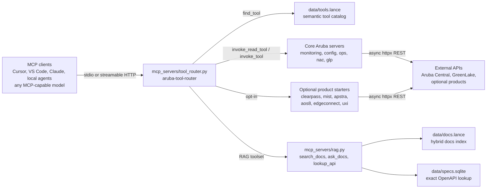
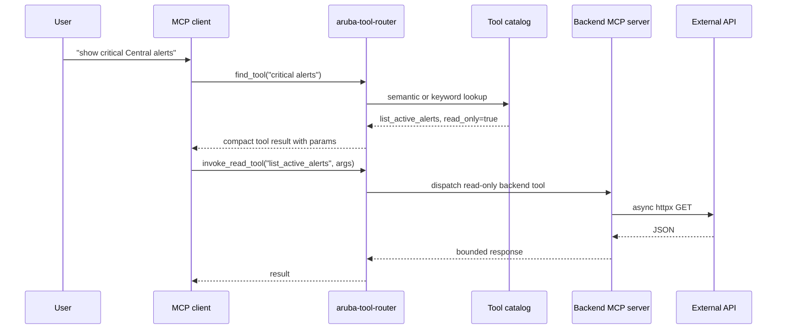
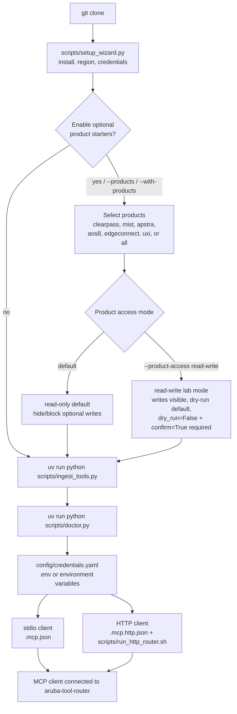

# centralmcp system overview

This page shows how the repo fits together for MCP users, contributors, and people evaluating the project from GitHub.

## Runtime architecture



The default MCP client profile should stay small:

```env
CENTRALMCP_ROUTER_MODE=minimal
CENTRALMCP_TOOLSETS=central,glp,rag
```

Optional products are disabled until explicitly enabled:

```env
CENTRALMCP_PRODUCTS=clearpass,mist,apstra,aos8,edgeconnect,uxi
```

## Tool discovery and dispatch



Use `invoke_read_tool` for normal investigations. Use `invoke_tool` only when the user intentionally asks for a write or destructive action; it is marked destructive because it can dispatch any enabled backend tool.

## Local setup flow



`scripts/setup_wizard.py` can run install, offer common Central API gateway
choices, fill credentials without echoing secrets, and enable only the optional
products you choose. `scripts/doctor.py` is intentionally non-mutating and does
not call Central, GLP, or optional product APIs. It checks local dependencies,
credentials/config paths, indexes, RAG source-manifest drift, router profile
drift, HTTP URL/transport mismatches, optional product env, and listener status.

## Tracked file structure

```text
.claude/                 Optional launch profiles and repo agent notes
.cursor/                 Cursor MCP profiles
.vscode/                 VS Code MCP example config
config/                  Credentials template
docs/                    User, architecture, setup, router, and product docs
ingestion/               Docs/API ingestion into LanceDB and SQLite
inputs/                  Example migration input templates
mcp_servers/             FastMCP servers and low-token router
pipeline/                Clients, migration stages, SSID helpers
resources/               API/Postman reference notes and resources
scripts/                 Local doctor, HTTP router helper, catalog ingest, release validation
tests/                   Unit, integration, and eval coverage

.mcp.json.example        Generic stdio MCP client example
.mcp.http.json.example   Generic streamable HTTP MCP client example
docker-compose.yml       Optional localhost-only Redis/Ollama server backend
run_pipeline.py          Migration pipeline CLI
run_ssid.py              SSID helper CLI
```

Generated local artifacts are intentionally git-ignored:

```text
config/credentials.yaml
.env
.mcp.json
.mcp.http.json
data/
state/
outputs/
ingestion/sources/
ingestion/markdown*/
```

The optional Redis/Ollama Docker helper uses Docker named volumes for service
state, so it does not create repo-local `redis_data/` or `ollama_data/`
directories on new setups.
