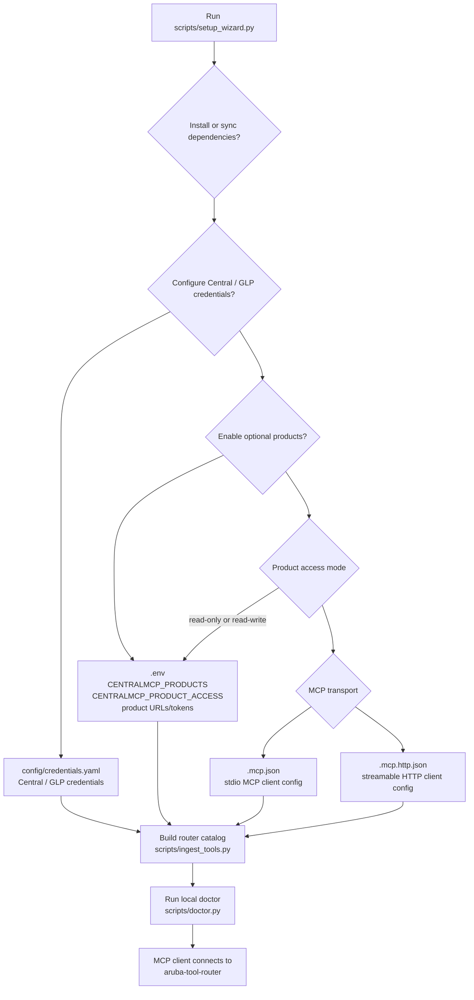

# Getting started

This guide gets a local clone running as an MCP server with the low-token router profile.

## 1. Install

```bash
git clone https://github.com/secure-ssid/centralmcp.git
cd centralmcp
python3 scripts/setup_wizard.py
```

Python 3.10+ is required. `uv` is recommended because the lockfile is maintained for this repo.

The guided setup wizard can run `uv sync`, create local git-ignored config
files, replace MCP path placeholders, choose a Central API gateway region, fill
credentials without echoing secrets, enable optional products, build the router
tool catalog, and run the local doctor.



If dependencies are already installed, or you want to skip any wizard phase:

```bash
python3 scripts/setup_wizard.py --skip-install
```

### Try without API credentials

You can verify dependencies, build the local router catalog, and start the HTTP
MCP server before adding Central or GLP credentials:

```bash
python3 scripts/setup_wizard.py --yes --skip-credentials
uv run python scripts/doctor.py
MCP_PORT=8010 bash scripts/run_http_router.sh
```

API-backed tools need credentials later, but this confirms the MCP server and
local catalog path first.

## 2. Configure credentials

The wizard creates `config/credentials.yaml` when it is missing and offers common
Central API gateway choices:

| Region / gateway | Base URL |
|---|---|
| US / common API gateway | `https://apigw-prod2.central.arubanetworks.com` |
| EU Central | `https://apigw-eucentral3.central.arubanetworks.com` |
| APAC | `https://apigw-apac.central.arubanetworks.com` |
| Legacy/internal gateway | `https://internal.api.central.arubanetworks.com` |
| Custom | Enter the tenant-specific URL from your Central portal/API docs |

To create the template manually:

```bash
cp config/credentials.yaml.example config/credentials.yaml
```

Fill in the preferred sections:

```yaml
central_account:
  base_url: https://apigw-prod2.central.arubanetworks.com
  client_id: YOUR_CENTRAL_CLIENT_ID
  client_secret: YOUR_CENTRAL_CLIENT_SECRET
  glp_workspace_id: YOUR_GLP_WORKSPACE_ID

glp_account:
  base_url: https://apigw-prod2.central.arubanetworks.com
  client_id: YOUR_GLP_CLIENT_ID
  client_secret: YOUR_GLP_CLIENT_SECRET
  glp_workspace_id: YOUR_GLP_WORKSPACE_ID
```

Environment variables override YAML values. Common overrides:

| Variable | Purpose |
|---|---|
| `SOURCE_BASE_URL`, `SOURCE_CLIENT_ID`, `SOURCE_CLIENT_SECRET` | Central/source account |
| `TARGET_BASE_URL`, `TARGET_CLIENT_ID`, `TARGET_CLIENT_SECRET` | GLP/target account |
| `SOURCE_GLP_WORKSPACE`, `TARGET_GLP_WORKSPACE` | Workspace IDs |
| `GLP_TOKEN_URL`, `GLP_BASE_URL` | GLP endpoint overrides |
| `TOKEN_CACHE_DIR` | Token cache directory |

## 3. Configure your MCP client

```bash
cp .mcp.json.example .mcp.json
```

The wizard does this and replaces `/path/to/centralmcp` with your local clone
path. If configuring manually, edit `.mcp.json` yourself.
For VS Code, copy `.vscode/mcp.json.example` to `.vscode/mcp.json`.
For included `.claude` launch profiles, use `.claude/launch.json`; the first profile is the
same minimal `aruba-tool-router` setup and the remaining profiles are direct
debug servers.
For clients that connect to an already-running HTTP MCP server, copy
`.mcp.http.json.example` to `.mcp.http.json` and edit the URL if you use a
different host or port. The copied file is local-only and git-ignored.
For client-specific examples, see [mcp-client-recipes.md](mcp-client-recipes.md).

Recommended default:

```env
CENTRALMCP_ROUTER_MODE=minimal
CENTRALMCP_TOOLSETS=central,glp,rag
```

This exposes only the router discovery/dispatch surface and keeps tool-list token cost low.

### Streamable HTTP instead of stdio

Any MCP-capable AI client/model can connect over streamable HTTP if the client
supports remote MCP servers.

Start the minimal router. The helper defaults to port `8010`, matching
`.mcp.http.json.example`:

```bash
MCP_PORT=8010 bash scripts/run_http_router.sh
```

Connect your client to:

```text
http://127.0.0.1:8010/mcp
```

The HTTP example in `.mcp.http.json.example` points at that local endpoint.
The helper safely loads expected local `.env` assignments first, so optional
product settings created by the wizard are available in HTTP mode.
If the port is already in use, `scripts/run_http_router.sh` exits before
starting another router and prints the listener details. Stop the foreground
server with `Ctrl-C`. If you launched it in the background, find the listener
and stop that PID:

```bash
lsof -nP -iTCP:8010 -sTCP:LISTEN
kill <PID>
```

Plain `curl` requests are expected to fail unless they send MCP streaming
headers such as `Accept: text/event-stream`; use an MCP client for actual tool
calls.

## 4. Build the tool catalog

```bash
uv run python scripts/ingest_tools.py
```

Include optional product starters:

```bash
uv run python scripts/ingest_tools.py --products all
```

Or let the wizard enable only the products you want:

```bash
python3 scripts/setup_wizard.py --products clearpass,mist --product-access read-write
```

Optional product read/write mode is lab-friendly: write tools are exposed, but
they dry-run by default and require `confirm=True` to execute.

## 5. Optional: build the docs/API RAG indexes

The router tool catalog is quick. The full docs/API index is larger. Fresh
clones need either a prebuilt release index or locally populated
`ingestion/sources/` input files before rebuilding docs/API search.

```bash
uv run python ingestion/ingest_docs.py
```

Built indexes live under `data/` and are git-ignored.

## 6. Validate

```bash
python3 scripts/setup_wizard.py --yes --skip-credentials --skip-catalog
uv run python scripts/doctor.py
uv run pytest tests/unit -q
uv run python scripts/validate_release.py
```

`scripts/doctor.py` is a non-mutating local setup diagnostic. It checks Python
modules, credentials/config paths, local stdio/HTTP MCP config copies, local
stdio placeholder paths, local low-token router profile drift, local HTTP URL
or transport mismatches, indexes, RAG source-manifest drift, low-token router
env, optional product names and required product env vars, and the HTTP router
port without calling Central or GLP APIs.

The unit suite includes static guards that keep async MCP tools off sync HTTP calls, prevent direct `CentralClient.session` bypasses, keep direct runtime dependencies on `httpx` instead of sync SDKs or `requests`, and protect the committed low-token MCP config examples.

## Optional product starters

Optional product backends are disabled by default.

```env
CENTRALMCP_PRODUCTS=clearpass,mist,apstra,aos8,edgeconnect,uxi
CENTRALMCP_PRODUCT_ACCESS=read-write
```

The wizard can prompt for the selected product URL/token settings, merge them
into local git-ignored `.env` while preserving existing token values, and add
the product selector plus access mode to local MCP configs. Use a subset when
you only want ClearPass, Mist, or another specific starter:

```bash
python3 scripts/setup_wizard.py --products clearpass
```

| Product | Required variables |
|---|---|
| ClearPass | `CLEARPASS_BASE_URL`, `CLEARPASS_API_TOKEN` |
| Mist | `MIST_HOST`, `MIST_API_TOKEN` |
| Apstra | `APSTRA_BASE_URL`, `APSTRA_API_TOKEN` |
| AOS8 | `AOS8_BASE_URL`, `AOS8_API_TOKEN` |
| EdgeConnect | `EDGECONNECT_BASE_URL`, `EDGECONNECT_API_TOKEN`, optional `EDGECONNECT_AUTH_HEADER` |
| UXI | `UXI_CLIENT_ID`, `UXI_CLIENT_SECRET`, optional `UXI_BASE_URL`, optional `UXI_TOKEN_URL` |

## Safety defaults

- GLP writes are disabled unless `CENTRALMCP_GLP_V2BETA1_WRITES=1`.
- Token caches are stored in `~/.cache/centralmcp/` by default with `0600` permissions.
- Use `invoke_read_tool` for read-only router dispatch.
- Use `invoke_tool` only for intentional writes/destructive actions.
