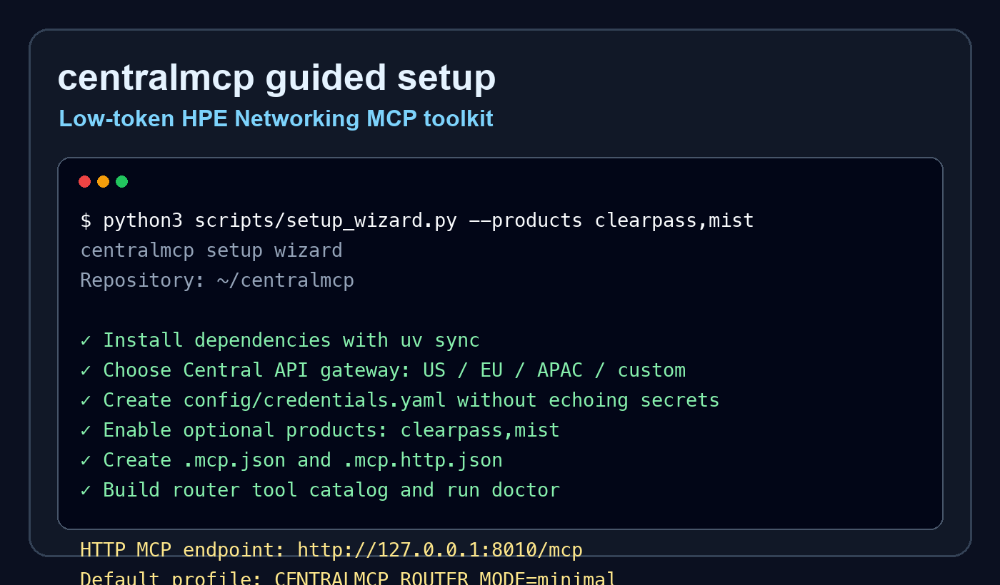

# centralmcp — HPE Networking MCP toolkit

Low-token Model Context Protocol tooling for HPE Aruba Central, HPE GreenLake
Platform, embedded docs/API lookup, and optional ClearPass, Mist, Apstra,
ArubaOS 8, and EdgeConnect starter backends.

## Start fast

```bash
git clone https://github.com/secure-ssid/centralmcp.git
cd centralmcp
python3 scripts/setup_wizard.py
```

The wizard can install dependencies, create local MCP configs, choose a Central
API gateway region, fill credentials without echoing secrets, enable selected
optional products, build the router catalog, and run the local doctor.



## Setup flow

```text
clone repo
   |
   v
run setup_wizard.py
   |
   +--> choose Central region / credentials
   +--> choose stdio or streamable HTTP
   +--> optionally enable ClearPass, Mist, Apstra, AOS8, EdgeConnect
   |
   v
run doctor.py
   |
   v
connect MCP client to aruba-tool-router
```

## Pick your path

| Goal | Guide |
|---|---|
| Install and connect an MCP client | [Getting started](getting-started.md) |
| Copy/paste stdio or HTTP client config | [MCP client recipes](mcp-client-recipes.md) |
| Enable ClearPass, Mist, Apstra, AOS8, or EdgeConnect | [Optional product starters](optional-products.md) |
| Plan typed product-specific workflows | [Typed product workflow roadmap](product-workflows.md) |
| Fix setup, credentials, HTTP, or catalog issues | [Troubleshooting](troubleshooting.md) |
| Download or package prebuilt RAG/OpenAPI indexes | [Prebuilt RAG/OpenAPI indexes](release-indexes.md) |
| Understand the low-token router | [Tool router](tool-router.md) |
| Try useful prompts | [Example prompts](example-prompts.md) |
| See architecture and flow diagrams | [System overview](architecture/system-overview.md) |
| Review RAG/OpenAPI lookup design | [RAG architecture](architecture/RAG-ARCHITECTURE.md) |

## Default low-token profile

```env
CENTRALMCP_ROUTER_MODE=minimal
CENTRALMCP_TOOLSETS=central,glp,rag
```

This exposes only `find_tool`, `invoke_read_tool`, and `invoke_tool` to the MCP
client while the router finds and dispatches backend tools on demand.

## Optional products

Enable only the product starters you want in the current session:

```bash
python3 scripts/setup_wizard.py --products clearpass,mist
```

Available starters:

| Product | Variables |
|---|---|
| ClearPass | `CLEARPASS_BASE_URL`, `CLEARPASS_API_TOKEN` |
| Mist | `MIST_HOST`, `MIST_API_TOKEN` |
| Apstra | `APSTRA_BASE_URL`, `APSTRA_API_TOKEN` |
| ArubaOS 8 | `AOS8_BASE_URL`, `AOS8_API_TOKEN` |
| EdgeConnect | `EDGECONNECT_BASE_URL`, `EDGECONNECT_API_TOKEN` |

See the [optional product matrix](optional-products.md) for the full setup and
safety model.

## Streamable HTTP

```bash
MCP_PORT=8010 bash scripts/run_http_router.sh
```

Then point an MCP-capable client to:

```text
http://127.0.0.1:8010/mcp
```

## Prebuilt docs/API search

For full docs/API search without local scraping, download the prebuilt release
indexes:

```bash
uv run python scripts/download_indexes.py
```

## Project links

- [GitHub repository](https://github.com/secure-ssid/centralmcp)
- [README](https://github.com/secure-ssid/centralmcp#readme)
- [Setup wizard source](https://github.com/secure-ssid/centralmcp/blob/main/scripts/setup_wizard.py)
- [Local setup doctor](https://github.com/secure-ssid/centralmcp/blob/main/scripts/doctor.py)
