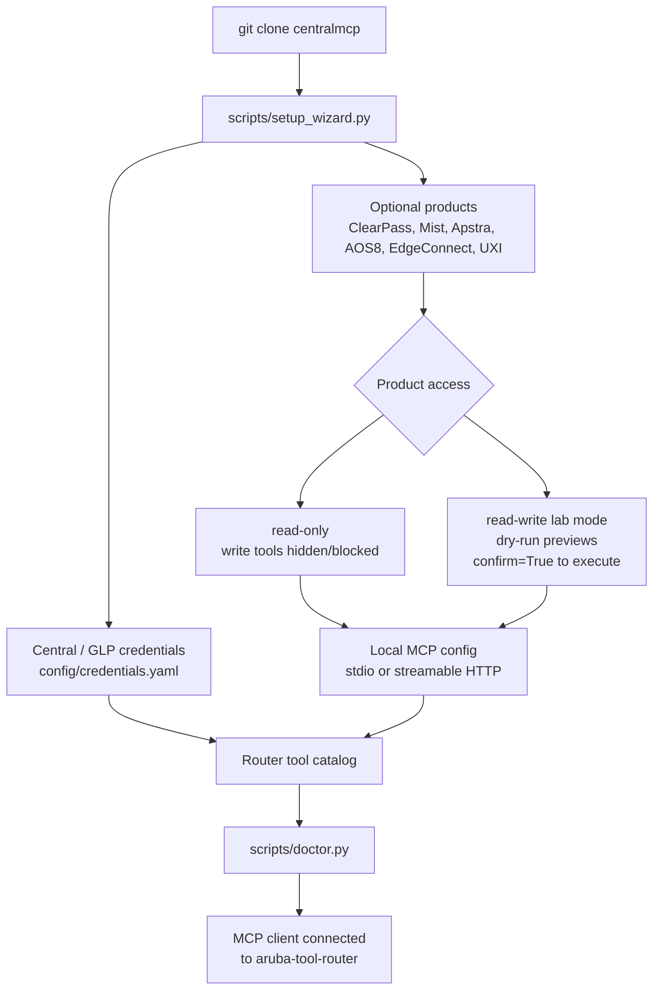

# centralmcp — HPE Networking MCP toolkit

Low-token Model Context Protocol tooling for HPE Aruba Central, HPE GreenLake
Platform, embedded docs/API lookup, and optional ClearPass, Mist, Apstra,
ArubaOS 8, EdgeConnect, and UXI starter backends.

## Search keywords

HPE Networking MCP server, HPE Aruba Networking MCP server, HPE Aruba Central
MCP server, Aruba Central AI tools, HPE GreenLake Platform MCP, GreenLake
Platform MCP, FastMCP network automation, Model Context Protocol networking,
network configuration MCP, Aruba API RAG, Aruba Central OpenAPI lookup,
ClearPass MCP, Juniper Mist MCP, Apstra MCP, ArubaOS 8 MCP, AOS8 automation,
HPE Aruba EdgeConnect MCP, HPE Aruba UXI MCP, guarded read/write lab automation,
EdgeConnect zones, zone-based firewall MCP, Python `httpx` network automation.

## Start fast

```bash
git clone https://github.com/secure-ssid/centralmcp.git
cd centralmcp
python3 scripts/setup_wizard.py
```

The wizard can install dependencies, create local MCP configs, choose a Central
API gateway region, fill credentials without echoing secrets, enable selected
optional products, build the router catalog, and run the local doctor.


## Setup flow



## Pick your path

| Goal | Guide |
|---|---|
| Install and connect an MCP client | [Getting started](getting-started.md) |
| Copy/paste stdio or HTTP client config | [MCP client recipes](mcp-client-recipes.md) |
| Enable ClearPass, Mist, Apstra, AOS8, EdgeConnect, or UXI | [Optional product starters](optional-products.md) |
| Plan typed product-specific workflows | [Typed product workflow roadmap](product-workflows.md) |
| Fix setup, credentials, HTTP, or catalog issues | [Troubleshooting](troubleshooting.md) |
| Download or package prebuilt RAG/OpenAPI indexes | [Prebuilt RAG/OpenAPI indexes](release-indexes.md) |
| Understand the low-token router | [Tool router](tool-router.md) |
| Try useful prompts | [Example prompts](example-prompts.md) |
| See architecture and flow diagrams | [System overview](architecture/system-overview.md) |
| Review RAG/OpenAPI lookup design | [RAG architecture](architecture/RAG-ARCHITECTURE.md) |

## Default low-token profile

```env
CENTRALMCP_ROUTER_MODE=minimal
CENTRALMCP_TOOLSETS=central,glp,rag
```

This exposes only `find_tool`, `invoke_read_tool`, and `invoke_tool` to the MCP
client while the router finds and dispatches backend tools on demand.

## Optional products

Enable only the product starters you want in the current session:

```bash
python3 scripts/setup_wizard.py --products clearpass,mist
```

Available starters:

| Product | Variables |
|---|---|
| ClearPass | `CLEARPASS_BASE_URL`, `CLEARPASS_API_TOKEN` |
| Juniper Mist | `MIST_HOST`, `MIST_API_TOKEN` |
| Apstra | `APSTRA_BASE_URL`, `APSTRA_API_TOKEN` |
| ArubaOS 8 | `AOS8_BASE_URL`, `AOS8_API_TOKEN` |
| EdgeConnect | `EDGECONNECT_BASE_URL`, `EDGECONNECT_API_TOKEN`, optional `EDGECONNECT_AUTH_HEADER` |
| HPE Aruba UXI | `UXI_CLIENT_ID`, `UXI_CLIENT_SECRET`, optional `UXI_BASE_URL`, optional `UXI_TOKEN_URL` |

See the [optional product matrix](optional-products.md) for the full setup and
safety model.

## Streamable HTTP

```bash
MCP_PORT=8010 bash scripts/run_http_router.sh
```

Then point an MCP-capable client to:

```text
http://127.0.0.1:8010/mcp
```

## Prebuilt docs/API search

For full docs/API search without local scraping, download the prebuilt release
indexes:

```bash
uv run python scripts/download_indexes.py
```

## Project links

- [GitHub repository](https://github.com/secure-ssid/centralmcp)
- [README](https://github.com/secure-ssid/centralmcp#readme)
- [Setup wizard source](https://github.com/secure-ssid/centralmcp/blob/main/scripts/setup_wizard.py)
- [Local setup doctor](https://github.com/secure-ssid/centralmcp/blob/main/scripts/doctor.py)

## Community and support

- [Support guide](https://github.com/secure-ssid/centralmcp/blob/main/SUPPORT.md) - where to ask setup, usage, bug, and feature questions
- [Contributing guide](https://github.com/secure-ssid/centralmcp/blob/main/CONTRIBUTING.md) - local setup, validation, docs, and no-secret expectations
- [Code of conduct](https://github.com/secure-ssid/centralmcp/blob/main/CODE_OF_CONDUCT.md) - collaboration expectations
- [Security policy](https://github.com/secure-ssid/centralmcp/blob/main/SECURITY.md) - private vulnerability and credential-exposure reporting guidance
- [GitHub issues](https://github.com/secure-ssid/centralmcp/issues) - bug reports, feature requests, and support questions with fake or redacted details

## Related projects and thanks

centralmcp is an independent HPE Networking MCP toolkit. It is improved by
watching the official MCP ecosystem and community work; thanks to these projects
for useful patterns and references:

- [HewlettPackard/gl-mcp](https://github.com/HewlettPackard/gl-mcp) - official GreenLake Platform MCP server
- [modelcontextprotocol/python-sdk](https://github.com/modelcontextprotocol/python-sdk) - MCP Python SDK
- [KarthikSKumar98/central-mcp-server](https://github.com/KarthikSKumar98/central-mcp-server) - community Aruba Central MCP server
- [nowireless4u/hpe-networking-mcp](https://github.com/nowireless4u/hpe-networking-mcp) - unified HPE networking MCP reference

## Disclaimer

centralmcp is an independent community project. It is not an official HPE or
HPE Aruba Networking product and is not endorsed by or supported by HPE.

## License

MIT - see the [repository license](https://github.com/secure-ssid/centralmcp/blob/main/LICENSE).
