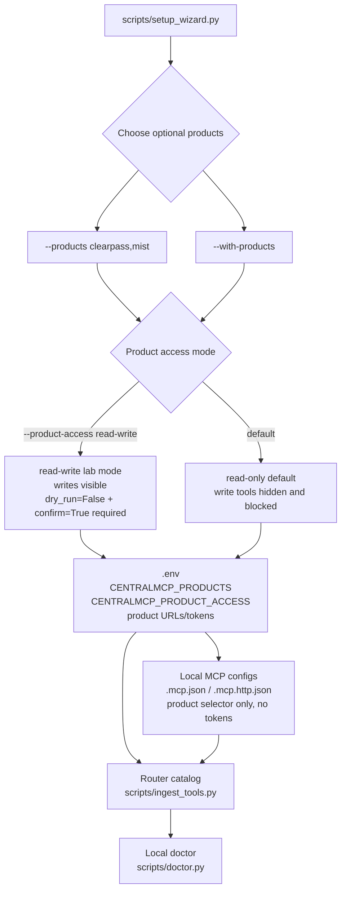

# Optional product starters

centralmcp keeps optional products disabled by default so normal MCP sessions
stay low-token. Enable only the starters you want for the current setup.

```bash
python3 scripts/setup_wizard.py --products clearpass,mist
```

Use every starter only when you intentionally want the broader catalog:

```bash
python3 scripts/setup_wizard.py --with-products
```

## Product matrix

| Product | Read-only / read-write tools | Enables | Required settings | Safety surface |
|---|---:|---|---|---|
| ClearPass | 9 / 15 | endpoint/auth/NAD/guest workflows plus bounded Insight alerts and OnGuard agent/posture operations | `CLEARPASS_BASE_URL`, `CLEARPASS_API_TOKEN` | Read/write; writes dry-run by default |
| Juniper Mist | 19 / 26 | wireless workflows plus NAC, Marvis clients/settings/events, org inventory/claims, Wired Assurance, and WAN Assurance | `MIST_HOST`, `MIST_API_TOKEN` | Read/write; writes dry-run by default |
| Apstra | 15 / 20 | session-authenticated blueprint, connectivity-template, application-point, anomaly, topology, and protocol workflows | `APSTRA_BASE_URL`, preferred `APSTRA_USERNAME`/`APSTRA_PASSWORD`, optional pre-issued `APSTRA_API_TOKEN` | Read/write; writes dry-run by default |
| ArubaOS 8 | 34 / 43 | UIDARUBA/X-CSRF session auth, operational/config exports, typed writes, and deterministic Classic/New Central migration plans | `AOS8_BASE_URL`, preferred `AOS8_USERNAME`/`AOS8_PASSWORD`, optional legacy `AOS8_API_TOKEN` | Read/write; writes dry-run by default |
| EdgeConnect | 32 / 49 | API/Swagger compatibility diagnostics plus explicitly gated legacy workflows | `EDGECONNECT_BASE_URL`, `EDGECONNECT_API_TOKEN`, optional `EDGECONNECT_AUTH_HEADER`, `EDGECONNECT_ALLOW_LEGACY_API`, and endpoint-specific `EDGECONNECT_AI_SESSION_AUTHORIZATION` | Legacy operational reads/writes fail closed by default; writes also dry-run by default |
| HPE Aruba UXI | 13 / 25 | sensor/agent/group/network/service-test inventories plus guarded CRUD and assignment workflows | `UXI_CLIENT_ID`, `UXI_CLIENT_SECRET`, optional `UXI_BASE_URL`, optional `UXI_TOKEN_URL` | Read/write; writes dry-run by default and outbound calls respect 5 requests/second |
| Axis Atmos Cloud | 12 / 25 | reviewed application, connector, tunnel, location, policy, status, and commit workflows | `AXIS_BASE_URL`, `AXIS_API_TOKEN` | Read/write; writes dry-run by default |
| **Optional subtotal** | **122 / 178** | Six opt-in product backends | Product-specific | Hidden and blocked unless enabled |

Combined with the 270 core Aruba/GLP/RAG tools, these modes produce the
392-tool all-product read-only catalog or the 448-tool read-write catalog.

The generic GET tools reject absolute URLs and stay bounded to the configured
product host. List-like responses are paged with `limit` and `offset` when
possible so broad API calls do not flood the MCP context.

Write-capable optional product tools are intended for lab and controlled
operations. They are annotated as write/destructive, default to `dry_run=True`,
and require `dry_run=False` plus `confirm=True` before sending API changes.
Optional product access defaults to `read-only`, which hides optional write
tools from router discovery and blocks direct write-tool execution. Set
`CENTRALMCP_PRODUCT_ACCESS=read-write` or run the setup wizard with
`--product-access read-write` only for trusted lab workflows where confirmed
writes are expected. Per-platform overrides such as
`CENTRALMCP_MIST_WRITES=1` and `CENTRALMCP_UXI_WRITES=1` can enable one product
without opening every optional backend. Unrecognized values fail closed.

For ArubaOS 8 typed configuration-object writes, the manage tools return
`requires_write_memory_for` with each affected `config_path`. Run
`aos8_write_memory` for those hierarchy nodes only after reviewing the pending
changes and confirming the staged config should be persisted.

Use `aos8_export_all` and `aos8_migration_plan` before migration work. The plan
normalizes WLANs, roles, VLANs, AP groups, controllers, and policies into
separate Classic Central and New Central candidates, reports lossy mappings,
produces deterministic diffs, and returns read-only post-migration checks.

EdgeConnect 9.3 changed endpoint definitions incompatibly. Run
`edgeconnect_doctor` against the target Orchestrator before using operational
tools. The bundled operational endpoint map predates 9.3 and is disabled
unless `EDGECONNECT_ALLOW_LEGACY_API=1` is deliberately set for a validated
older/lab instance. A production 9.3+ remap requires that Orchestrator's
instance-hosted Swagger specification.

Generated EdgeConnect multipart upload tools accept file fields as
`{"filename": "...", "content_base64": "...", "content_type": "..."}` and
enforce a 20 MiB decoded-file limit.

Product base URLs must use HTTPS and public hostnames by default. For local lab
testing against localhost or private IPs, set
`CENTRALMCP_ALLOW_LOCAL_PRODUCT_URLS=1` only in that trusted lab environment.

## What the wizard writes

When you select products, the setup wizard:



1. Adds or merges `CENTRALMCP_PRODUCTS`, `CENTRALMCP_PRODUCT_ACCESS`, and
   product URL/token settings into local `.env`; existing non-placeholder token
   values are preserved unless you pass `--force`.
2. Adds only `CENTRALMCP_PRODUCTS` and `CENTRALMCP_PRODUCT_ACCESS` to local MCP
   config files, leaving product tokens in `.env`.
3. Builds the router tool catalog with the selected product starters (or every
   starter with `--with-products`) and access mode; product tokens are not
   passed to the catalog-build subprocess.
4. Lets `scripts/doctor.py` confirm required product variables are present.

Real `.env`, `.mcp.json`, and `.vscode/mcp.json` files are git-ignored.

## Manual setup

The wizard defaults optional products to read-only and records the access mode
in local `.env` / MCP config files. Use explicit read/write lab mode when you
want write tools visible and still guarded by `dry_run=False` plus
`confirm=True`:

```bash
python3 scripts/setup_wizard.py --products clearpass,mist --product-access read-write
```

Omit `--product-access read-write` if you want generated local configs to keep
the safer read-only operating posture.

For manual shell setup:

```bash
export CENTRALMCP_PRODUCTS=clearpass,mist
export CENTRALMCP_PRODUCT_ACCESS=read-only
export CLEARPASS_BASE_URL=https://clearpass.example.com
export CLEARPASS_API_TOKEN=...
export MIST_HOST=https://api.mist.com
export MIST_API_TOKEN=...
uv run python scripts/ingest_tools.py --products clearpass,mist
```

Set `CENTRALMCP_PRODUCT_ACCESS=read-write` in the same shell only when you want
lab write tools indexed and visible.

For streamable HTTP, `scripts/run_http_router.sh` safely loads expected local
`.env` assignments before starting the router, including the product selector,
access mode, supported product URL/token variables, and UXI OAuth settings:

```bash
MCP_PORT=8010 bash scripts/run_http_router.sh
```

## When to add product-specific tools

Keep expanding typed product tools when a workflow is common enough to deserve
a named function instead of a generic GET call, for example:

| Workflow type | Better as a typed tool? |
|---|---|
| "Show ClearPass endpoint status for this MAC" | Yes |
| "List Mist sites with client counts" | Yes |
| "Fetch this one documented endpoint while exploring" | Generic GET is fine |
| "Perform a write/remediation action" | Yes, with explicit destructive annotations and confirmation |

See [Typed product workflow roadmap](product-workflows.md) for implemented
ClearPass, Mist, Apstra, ArubaOS 8, EdgeConnect, and UXI workflows plus
candidates.
